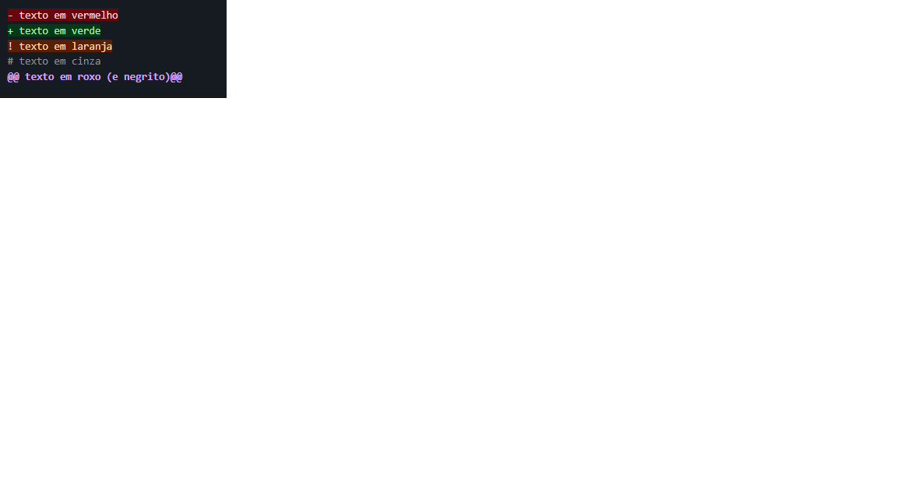

1- **O que é Markdown**
    Resumindo bem rápido: é apenas um arquivo de texto, como .txt .doc etc... (.md incluso).

2- **Porque usar Markdown?**
 *  Rápido de usar 
        *Ele economiza tempo em comparação com outros tipos de arquivos / formatos de texto. Isso ajuda a aumentar a produtividade e os fluxos de trabalho do escritor.*

 * Fácil de usar 
        *A sintaxe é tão fácil que você pode aprender em um minuto ou dois, em seguida, escreva sem perceber nada estranho ou nerd.*

 * Tipagem e sintaxe limpas
        *Tanto a sintaxe como a saída são limpas, sem confusão com nossos olhos e simples de gerenciar.*

 * Flexível
        *Com apenas algumas configurações, o seu texto será traduzido atravessando qualquer plataforma lá fora, editável em qualquer software de edição de texto e conversível para uma ampla variedade de formatos.*

    Em resumo, os usuários comuns acharão útil em todos os casos, especialmente quando você precisar de algo melhor que o texto simples, mas menos funcional do que o Microsoft Word.
Para desenvolvedores, Se você é preguiçoso para escrever código HTML, você vai adorar o markdown. Além disso, Github e muitos sites favorecem o markdown para o arquivo readme de projetos. Isso significa que você vai encontrar o markdown em sua vida de uma forma ou de outra.


2.1- **Ferramentas para Markdown**
  * Stackedit 
         Ok, você pode parar de ler agora. Clique no link e, em seguida, comece o seu turno de markdown de uma maneira mais rápida. Basta digitar o texto normal e depois usar o mouse, clique no botão. Você não precisa saber a sintaxe. É bom, mas fará você dependende, e a maioria dos desenvolvedores prefere os teclados.

  * Dillinger
         Ferramenta on-line, suporte em exibição ao vivo (tela dividida) e exportação para html. Nada muito especial, mas muito limpo e acessível.

  * Typora
         Disponível para Mac e Windows, mínimo, livre de distração, vista ao vivo sem parecer, empacotada com muitas outras coisas como Imagens, Listas, Tabelas, Cercas de Código, Blocos de Matemática, YAML, Front Matters, Toc, ...

  * Atom
         Editor de texto popular hackeável (você pode estar usando isso). Sim, isso é versátil. Suporte Markdown? Apenas uma parte disso, mas é muito construído.

  * Minimalist Markdown
         Aplicativo do Google Chrome. Funciona em todos os lugares se você tiver o Chrome instalado (este é o meu favorito).

  * Macdown
         O Melhor para Mac

  * MarkdownPad
         O Melhor para Windows.

  * Remarkable
         O Melhor para Linux.

  * GITBOOK
         O GitBook é uma ferramenta de publicação moderna. Facilitando a escrita e a colaboração. Ambos suportam a Markdown e têm uma estreita relação com o amado Github.  


3- **Sintaxe do Markdown**
Formato	Sintaxe	Exemplo
Itálico: *Text*
Negrito: **Bold**
Links Inline: [texto](url aqui)
Imagens: 
Link + Imagens: [](url da pagina)]
Quebras de Linha: Double space + enter
Listas Não Ordenadas: * Item1 *Item 2
Listas Ordenadas: 1. Item a 2. Item b
Listas Mistas: 1. Item 1 * item 1a
Citação: > Texto citado
Preformatted :Comece cada linha com, dois espaços ou mais, faça o look do texto, e x a t a m e n t e, como, você, tipo i, s, t, o.
Código: `Insira o código`
Bloco de Código/ Destaque de Sintaxe: ```Insira o código```
Títulos: #, ##, ###, ####, #####, ###### (from h1 to h6)
Riscado: ~Insira o texto aqui~
Tabelas: | Tables | Are | Cool | |----------|:-------------:|------:| | col 1 is| left-aligned | $1600 |
Notas de Rodapé: Notas de rodapé[^1] [^1]: Refêrencia


4.0- **Notas úteis**
 * O Markdown permite que você use escapes de barra invertida para gerar caracteres literais que de outra forma teria um significado especial na sintaxe de formatação da Markdown. Um personagem de escape de barra invertida comumente usado é :\
Assim? \ * Este \ * não é mais itálico, mas é cercado por asteriscos literais.

* Os vídeos do Youtube requerem algum trabalho adicional.
    Eles não podem ser adicionados diretamente, mas você pode adicionar uma imagem com um link para o vídeo como este:
    " <a href="http://www.youtube.com/watch?feature=player_embedded&v=YOUTUBE_VIDEO_ID_HERE
    " target="_blank"></a>"

* Markdown suporta Emoji 😆 😆 😘 😇 💚 (https://www.webfx.com/tools/emoji-cheat-sheet/)

* Você pode usar a tag <br/> para forçar uma quebra de linha.

* O espaço duplo, em seguida, se você quiser fazer uma nova linha se houver problemas para criar novas linhas.

* Ver não é tão bom como praticar. Você pode criar um arquivo de markdown para você praticar ou fazê-lo online aqui.

* As notas de rodapé e o destaque de sintaxe não fazem parte do Markdown original e são apenas suportados por certas versões de markdown (Feedback de Sean Brody)

* Qualquer URL (Como http://www.github.com/) será automaticamente convertido em um link clicável.

* O suporte à tabela Markdown é projetado para lidar com a maioria das tabelas para a maioria das pessoas; não cobre todas as tabelas para todas as pessoas. Se você precisa de tabelas complexas, você precisará criá-las manualmente ou com uma ferramenta especificamente projetada para o formato de saída.

* Usando imagens e links, você pode criar alguns recursos coloridos no momento da renderização. Badges como este são exemplos típicos que você pode encontrar em todo o Github Java HTML CSS JavaScript Linkedin Github  [get some badges here](https://shields.io/)

* Usando a sintaxe do bloco de código diff para gerar texto colorido. Ainda existem algumas limitações como não conseguir estilizar o texto dentro da caixa diff e poucas cores para a formatação. Isso pode ser aplicável quando você deseja destacar alguma nota ou mostrar a diferença entre dois blocos de código
  

    